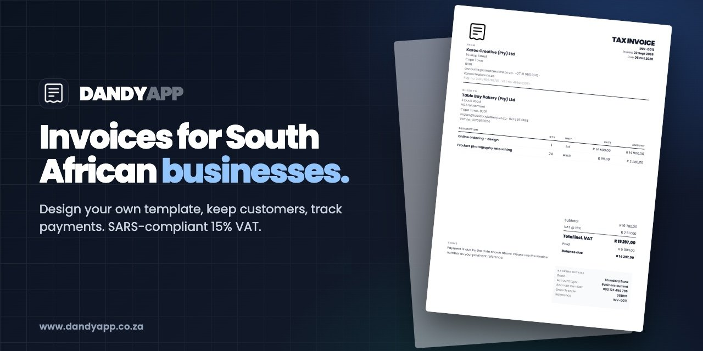

# DANDYAPP

A free, private invoicing app for South African businesses. SARS-compliant 15% VAT, your own template, customers and payments. Live at **[www.dandyapp.co.za](https://www.dandyapp.co.za)**.



## Use it

1. **Settings**: add your business details, banking and logo.
2. **Customers**: add them, or import a CSV.
3. **New invoice**: pick a customer, add lines, click **Download PDF**.
4. **Dashboard**: download a backup now and then.

> [!IMPORTANT]
> Your data lives in your browser on your device and is never uploaded. Clearing site data or switching browser or device starts you empty, so back up regularly (Dashboard or Settings, then Restore from Settings).

## Contribute

No install and no build step.

```bash
git clone https://github.com/SirMcKenzie/dandyapp.co.za.git
cd dandyapp.co.za
python3 -m http.server 8000   # open http://localhost:8000
```

Edit files and reload. Deploys to Cloudflare Pages on push to `main`.

## How it is built

Vanilla JS with no framework or bundler. Scripts share a few globals, and Dexie (IndexedDB) is vendored in `js/vendor`.

```
index.html      App shell
sw.js           Service worker (offline, network first)
_headers        Security headers and CSP (Cloudflare Pages)
css/            dandy.css (design system), app.css (views, designer, print)
js/billing.js   Money in integer cents, VAT, payments, compliance
js/layout.js    Paginates an invoice into A4 pages
js/components.js  Template boxes and the rules that keep them printable
js/db.js        The only file that touches storage, plus migration and backup
js/locks.js     Cross-tab locks so two tabs never edit the same thing
js/app.js       Hash router
js/views/       One file per page
```

The preview, the PDF and the designer all render through `layout.js`, so what you design is what prints.

---

DANDYAPP does not provide financial, tax or legal advice. You are responsible for confirming every invoice you issue is correct.

Built by [Matthew McKenzie](https://www.matthewmckenzie.co.za) through [STRKR Studio](https://www.strkr.co.za). Copyright 2026 DANDYAPP. All rights reserved.
